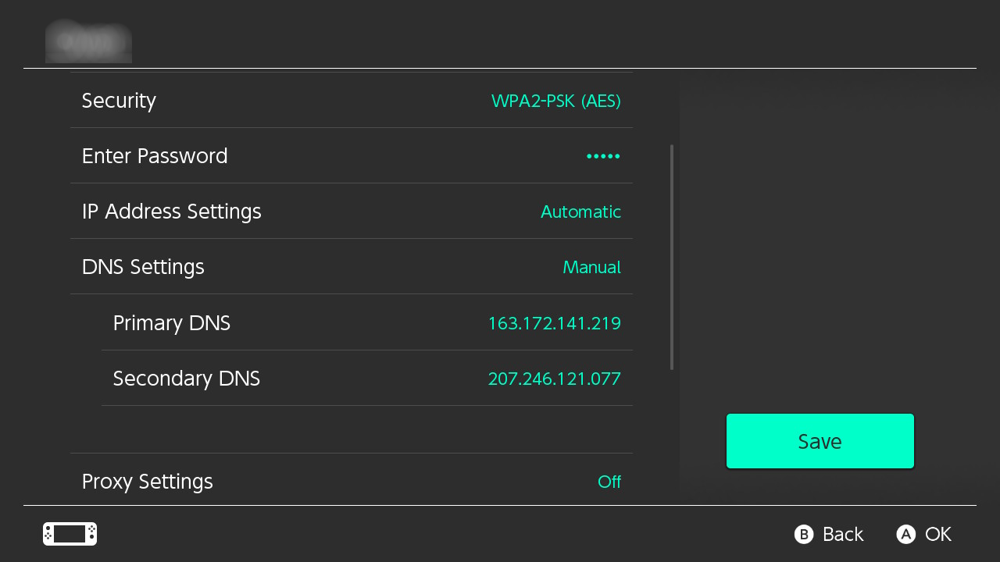

# Bloquer les mises à jour

Cette page vous aidera à mettre en place une méthode pour bloquer toute communication avec Nintendo. Cela permettra d’empêcher toutes les mises à jour et les rapports d'être envoyés à Nintendo, mais cela d’empêchera également l’utilisation de l’eShop et des jeux en ligne.

### Instructions (redirection DNS AMS)
Vous pouvez configurer Atmosphère pour rediriger automatiquement toutes les demandes dirigées vers Nintendo vers "rien" à la place. La documentation sur cette fonctionnalité peut être [trouvée ici](https://github.com/Atmosphere-NX/Atmosphere/blob/master/docs/features/dns_mitm.md). La section ci-dessous vous aidera à configurer la redirection DNS sur votre emummc. *Notez que cela ne s’appliquera que lorsque vous utilisez un CFW.*

#### Ce dont vous aurez besoin : 

- <a href="../../files/emummc.txt" download>emummc.txt</a>
- Atmosphère 0.18.0 ou plus récent

#### Setup:

1. Insérez votre carte SD dans votre PC
2. Allez dans le dossier `atmosphere`
3. S'il n'existe pas déjà, créez un dossier nommé `hosts`
4. Copiez le fichier `emummc.txt` dans ce dossier `hosts`
    - Si vous souhaitez appliquer la redirection DNS à sysmmc au lieu d’emummc, renommer le fichier en `sysmmc.txt`

!!! note "Tester la fonctionnalité"
    Vous pouvez vérifier le bon fonctionnement de la redirection DNS en démarrant votre emummc (ou sysmmc si vous avez appliqué la config à sys), et en éteignant la console après.
    
    Un rapport sera généré dans sd:/atmosphere/logs appelé `dns_mitm_startup.log`. Si cela commence par ce qui suit, la redirection DNS est active

    !!! tip ""
        

&nbsp;

### Instructions (90dns)
Vous pouvez ajouter un DNS personnalisé à votre connexion WiFi qui bloquera toute communication avec les serveurs de Nintendo. Nous allons utiliser [90DNS](https://gitlab.com/a/90dns), un serveur DNS personnalisé géré par la communauté. Si vous préférez, vous pouvez exécuter votre propre serveur DNS en suivant les instructions sur ce [répertoire GitLab.](https://gitlab.com/a/90dns/blob/master/SELFHOST.md)

!!! tip ""
    Entrez dans les paramètres système de la console, puis passez à l’onglet Internet. De là :
    

    ### Paramétrer un nouvelle connexion WiFi
    
    !!! warning "Réseau WiFi sans mot de passe"
        Tous les réseaux WiFi n’ont pas besoin d’un mot de passe pour se connecter. Si votre réseau n’en utilise pas, vous pouvez utiliser l’option `Configuration manuelle`, située au bas de l’écran `Paramètres Internet` en dessous de tous les autres réseaux WiFi.
        
    1. Sélectionnez votre réseau WiFi à partir de la liste des réseaux disponibles.
    2. Entrez un mot de passe **incorrect** qui a une longueure de 8 caractères et appuyez sur `OK`.
    3. Après quelques instants de tentative de connexion, la console affichera une erreur de connexion.
    4. Fermez le message d'erreur.
    5. Appuyez sur `Fermer` quand la console vous propose d'afficher plus de détails sur l'erreur.
    6. Lorsque la console vous demande si vous souhaitez entrer un nouveau mot de passe, cliquez sur `Voir les paramètres de ce réseau`.
    7. Changez les paramètres DNS en `Mode Manuel`.
    8. Choisissez le serveur qui est le plus proche de votre emplacement géographique à partir du graphique ci-dessous et entrez son `DNS Primaire` et `DNS Secondaire` dans les paramètres.
    9. Entrez le mot de passe correct de votre connexion WiFi.
    10. Sauvegardez les paramètres et testez la connexion.

    -----

    ### Paramétrer une connexion WiFi existante
    1. Sélectionnez votre réseau WiFi dans la liste des réseaux disponibles.
    2. Sélectionnez `Changer les paramètres`.
    3. Choisissez le serveur qui est le plus proche de votre emplacement géographique à partir du tableau ci-dessous et entrez son `DNS Primaire` et `DNS Secondaire` dans les paramètres.
    4. Sauvegardez les paramètres et testez la connexion.

   
| Lieu                                  | DNS Primaire        | DNS Secondaire      |
|:--------------------------------------|:--------------------|:--------------------|
| Europe (Serveur localisé en France)   | `163.172.141.219`   | `207.246.121.77`    |
| Amérique (Serveur localisé aux USA)   | `207.246.121.77`    | `163.172.141.219`   |

!!! tip ""
    Exemple pour une connexion 90dns en France :
    

&nbsp;

## Tester si vous avez accès aux serveurs de Nintendo

### Test via l'eShop (Stock)

!!! tip ""
    1. Ouvrez l’eShop. Attendez qu’il s’ouvre ou affiche une erreur
    2. Si une erreur apparait, vous devriez avoir réussi à bloquer Nintendo

### Test via une application homebrew (CFW)

!!! tip ""
    1. Téléchargez la dernière version de [90dns Tester](https://github.com/meganukebmp/Switch_90DNS_tester/releases)
    2. Placez le fichier `Switch_90DNS_tester.nro` dans le dossier `switch` sur votre carte SD
    3. Entrez dans le menu homebrew et lancez 90dns Tester
    4. Une fois le test terminé, il devrait ressembler à l’image ci-dessous, avec chaque domaine `nintendo` bloqué (blocked)

!!! tip ""
    

