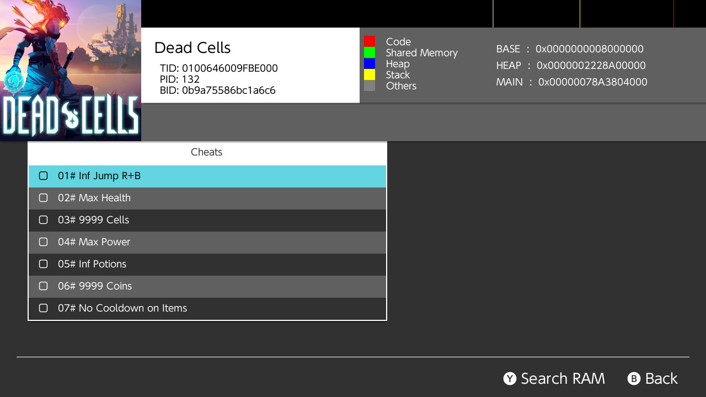

# Utiliser des cheats

Pour gérer les cheats, [EdiZon](https://github.com/WerWolv/EdiZon/releases) est recommandé. Il permet de facilement utiliser le module de cheats d'Atmosphère en activant ou désactivant les cheats utilisés.

&nbsp;

### Instructions

!!! tip ""
    Atmosphère charge les cheat codes depuis `contents`, un sous-dossier du dossier `atmosphere`. Le chemin d'accès typique est `sd:/atmosphere/contents/<title_id>/cheats/<build_id>.txt`.
    Vous devez créer le dossier `<title_id>` et ses sous-dossiers manuellement.

    - `title_id` est le title ou programme d'un jeu. Il est unique pour chaque jeu.
    - `build_id` est la version d'un jeu. Les cheats peuvent être spécifiques à une certaine version du jeu donc soyez certain d'utiliser des cheats compatibles avec votre version du jeu.

    **Note : Sur Atmosphère 0.9.4 et moins `contents` est appelé `titles`**.

    Les title ID et build ID d'un jeu peuvent être trouvés en utilisant le menu de triche d'EdiZon (TID et BID, cf. exemple ci-dessous). Une fois que le jeu est lancé sous Atmosphère, vos cheats devraient être actifs.

!!! tip "Empêcher les cheats d'être actifs"
    Pour empêcher les cheats d'être activés par défaut, vous pouvez changer votre configuration d'Atmosphère :

    - Copiez `system_settings.ini` depuis `/atmosphere/config_templates` vers `/atmosphere/config` si il n'existe pas déjà.
    - Éditez la ligne `; dmnt_cheats_enabled_by_default = u8!0x1` pour qu'elle affiche `dmnt_cheats_enabled_by_default = u8!0x0`. Soyez certain de supprimer l'espace et le point-virgule " ;"

    Par défaut, maintenir le bouton L au lancement d'un jeu désactivera tous les cheats.

Pour une description plus détaillée du module de cheat d'Atmosphère, référez-vous à [cette page](https://github.com/Atmosphere-NX/Atmosphere/blob/master/docs/features/cheats.md).

!!! tip "Les cheats dans EdiZon"
    Ici le title ID du jeu (TID) est "0100646009FBE000" et le build ID du jeu (BID) is "0B9A75586BC1A6C6". Les cheats sont donc chargés depuis `sd:/atmosphere/contents/0100646009FBE000/cheats/0B9A75586BC1A6C6.txt`.

    !!! tip ""
	    