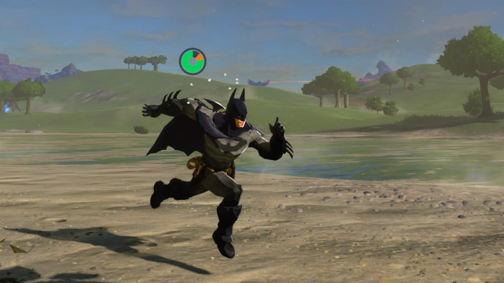

# Modder des jeux avec LayeredFS

LayeredFS, un outil intégré à Atmosphère, vous permet de remplacer les fichiers de jeu par les vôtres.

&nbsp;

### Instructions

!!! tip ""
    Créez un dossier dans le dossier `atmosphere/contents/` sur votre carte SD, et donnez lui comme nom le title ID du jeux à modder. **Note : Sur Atmosphère 0.9.4 ou moins `contents` s'appelle `titles`**

    Les title ID de jeux Switch peuvent être trouvés sur [http://nswdb.com/](http://nswdb.com/). Si vous avez un mod à installer, celui-ci doit être placé dans ce dossier. Ensuite, une fois que le jeu est lancé sous Atmosphère, votre mod devrait s'appliquer. Par défaut, maintenir le bouton L enfoncé pendant le lancement d'un jeu désactivera tous les mods.
    
!!! tip "Batman dans BOTW"
	
