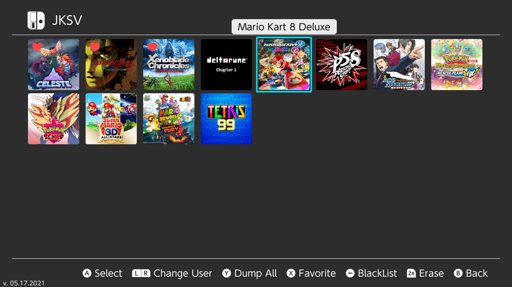
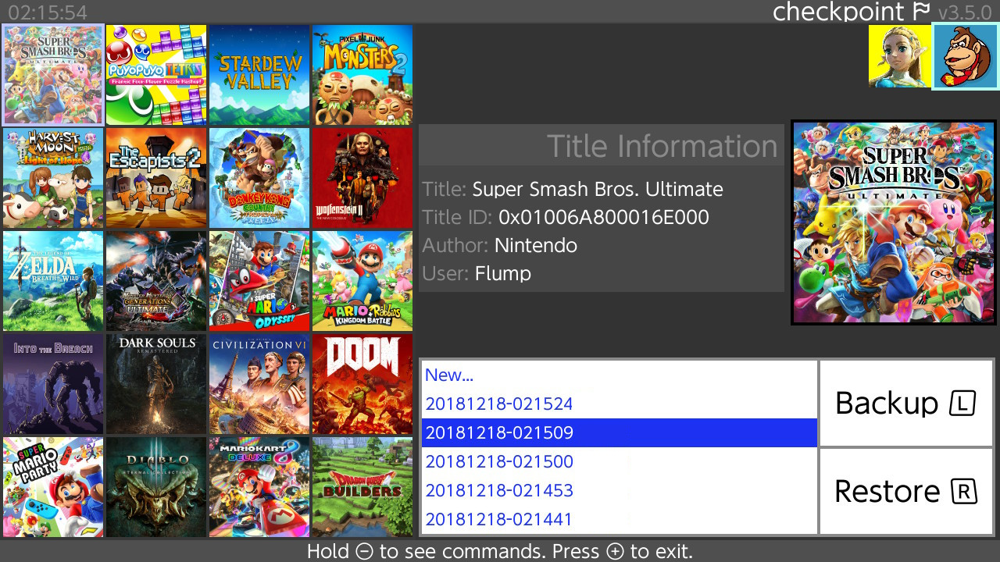

# Gestion des sauvegardes (de jeux)

Pour la gestion des fichiers de sauvegarde,  [JKSV](https://github.com/J-D-K/JKSV) est recommandé. Il peut être utilisé pour récupérer et restaurer des sauvegardes de jeu sur votre carte SD.

[Checkpoint](https://github.com/flagbrew/checkpoint/releases) est également un gestionnaire de sauvegardes. Il peut être utilisé pour récupérer et restaurer des sauvegardes de jeu sur votre carte SD. Il a également la possibilité de partager ces fichiers via FTP et WiFi.

&nbsp;
	
### JKSV
Prenez le temps de lire la [page d'accueil de JKSV](https://github.com/J-D-K/JKSV) pour plus d'informations.

!!! tip ""
	

### Checkpoint
Prenez le temps de lire la [page de présentation de Checkpoint](https://github.com/flagbrew/checkpoint) pour plus d'informations.

!!! tip ""
	
