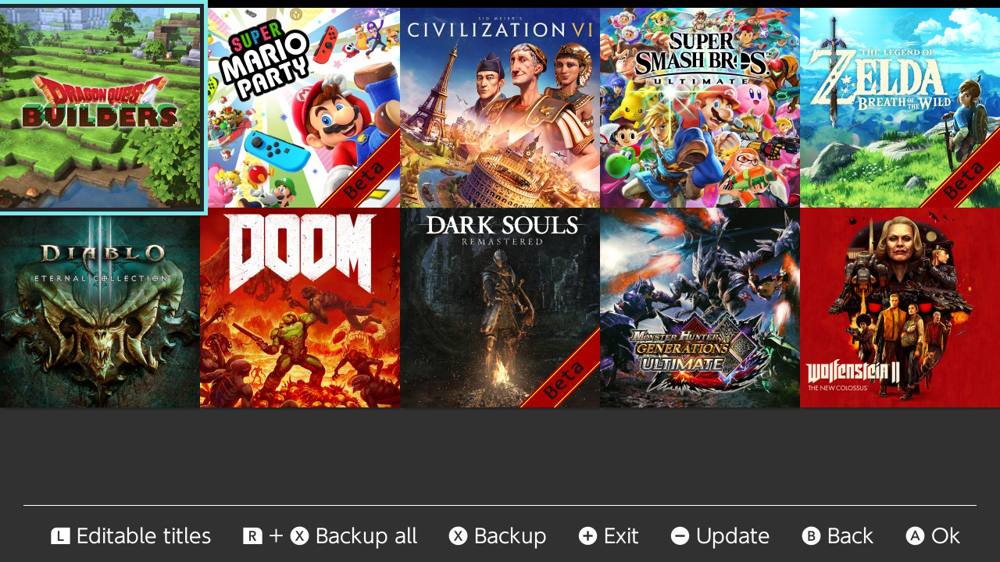

# Gestion des sauvegardes (de jeux)

Pour la gestion des fichiers de sauvegarde,  [Edizon](https://github.com/WerWolv/EdiZon/releases) est recommandé. Il peut être utilisé pour récupérer et restaurer des sauvegardes de jeu sur votre carte SD. Il a également la possibilité d'éditer des sauvegardes pour certains jeux directement depuis votre Switch. Il permet également de gérer le moteur de triche d’Atmosphère, fournissant un moyen facile de télécharger de nouveaux codes de triche, ainsi que de les activer/désactiver individuellement.

[Checkpoint](https://github.com/flagbrew/checkpoint/releases) est également un gestionnaire de sauvegardes. Il peut être utilisé pour récupérer et restaurer des sauvegardes de jeu sur votre carte SD. Il a également la possibilité de partager ces fichiers via FTP et WiFi.

&nbsp;
	
### Edizon
Prenez le temps de lire la [page d'accueil d'Edizon](https://github.com/WerWolv98/EdiZon) pour plus d'informations.

!!! tip ""
	

### Checkpoint
Prenez le temps de lire la [page de présentation de Checkpoint](https://github.com/FlagBrew/Checkpoint#usage) pour plus d'informations.

!!! tip ""
	
