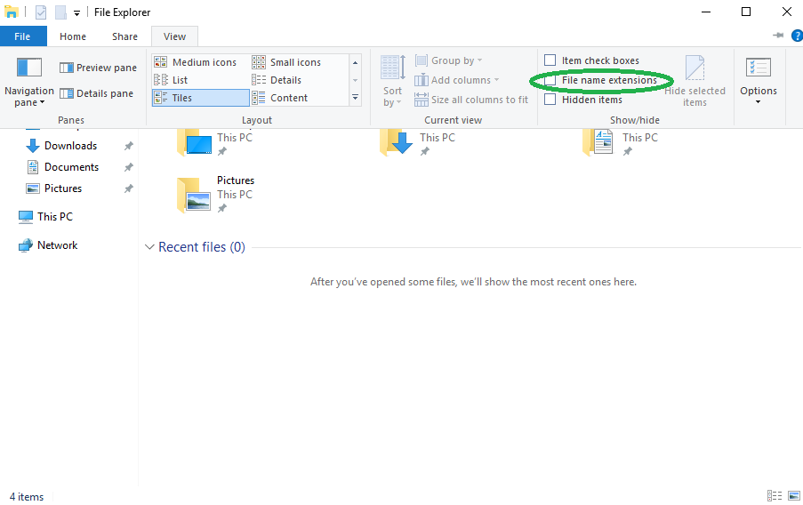

# Affichage des extensions des noms de fichiers sur Windows 10

Par défaut, Microsoft Windows 10 n’affiche pas les extensions de fichiers pour les types de fichiers connus. Cela peut entraîner des problèmes lorsque vous devez renommer des fichiers.

&nbsp;

### Instructions

!!! tip ""
    1. Ouvrez une nouvelle fenêtre de l'Explorateur de fichiers.
    2. Allez sur l'onglet `Affichage` (*View* en anglais).
    3. Sur cet onglet, si la case `Extension de noms de fichiers` (*File name extensions* en anglais) n'est pas cochée, cochez la.

!!! tip ""
    
