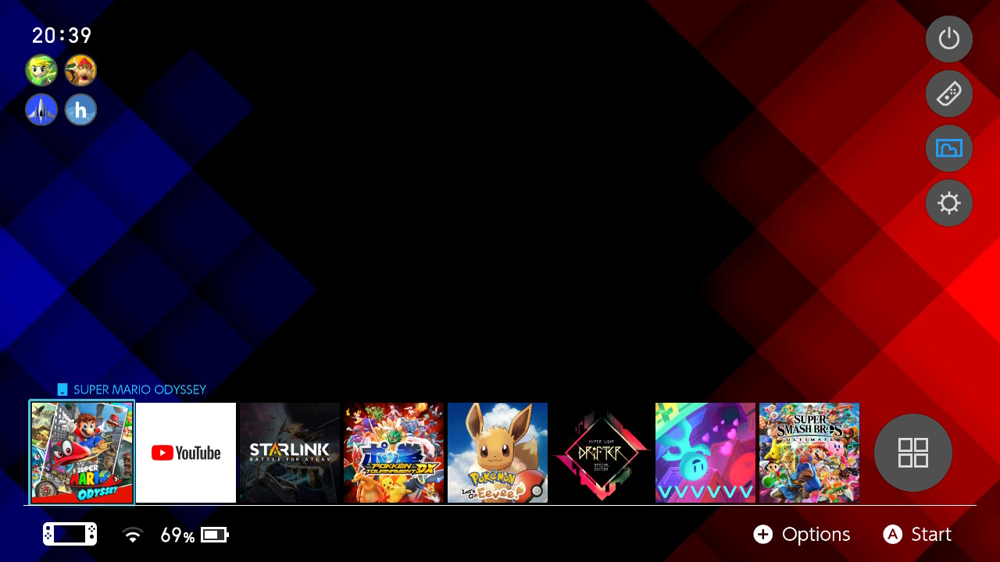

# Modifier le thème

Vous pouvez créer des styles et des mises en page uniques pour votre menu Home sur la Switch.

&nbsp;

!!! tip ""
	

!!! tip "Que puis-je faire ?"
	Référez vous à la section `Créer un thème` si vous voulez créer un thème.

	Référez vous à la section `Installer un thème` si vous voulez installer un thème.

	Référez vous à la section `Installer une police personnalisée` si vous voulez installer une police personnalisée.

&nbsp;

## Créer un thème (Windows)

### Ce dont vous aurez besoin

La dernière version de <a href="https://github.com/exelix11/SwitchThemeInjector/releases" target="_blank">**Switch Theme Injector**</a>

- Vous devez télécharger l'archive `ReleaseVx.x.zip` dans les assets.

### Création du thème

1. Dézippez `ReleaseVx.x.zip` sur votre PC.
2. Lancez l'application `SwitchThemes.exe`. Allez à `NXTheme Builder`.
3. Sélectionnez un élément du menu Home, une image 720p et une mise en page. Cliquez sur `Build NXTheme` une fois votre choix fait.
4. Remplissez les informations dans la fenêtre qui apparaît. Cliquez sur `OK` et choisissez où enregister votre création.
5. Répétez les étapes 3 et 4 pour chaque partie du menu Home de la Switch que vous souhaitez modifier.

&nbsp;

## Créer un thème (Mac / Linux / Chrome OS)

### Création du thème

Assurez-vous que les images que vous souhaitez utiliser sont de taille 1280x720 et en format JPG !

1. Allez à <a href="https://exelix11.github.io/SwitchThemeInjector/v2/" target="_blank">.**Exelix's Web Injector**</a>
2. Sélectionnezun élément du menu Home que vous souhaitez modifier. Après cela, cliquez sur le bouton `Open an Image` et sélectionnez votre image d’arrière-plan.
3. Choisissez un nom de thème et un nom d’auteur et une mise en page différente si vous le souhaitez, puis cliquez sur `build NxTheme`.
4. Votre navigateur vous invitera à télécharger un fichier. Enregistrez ce fichier dans un dossier.
5. Répétez les étapes 2 à 4 pour chaque partie du menu Home de la Switch que vous souhaitez modifier.
	
&nbsp;

## Installer un thème

!!! tip "Thèmes de la communauté"
	Si vous souhaitez utiliser des thèmes de la communauté, par exemple sur <a href="https://www.reddit.com/r/NXThemes/" target="_blank">**r/NXThemes**</a>, vous pouvez suivre le guide ci-dessous pour installer un nxtheme obtenu via la communauté

!!! tip "Homebrew app store"
	Si vous souhaitez utiliser l’homebrew app store pour les thèmes, vous pouvez simplement installer le thème que vous voulez via l’appstore, et suivre les instructions à partir de l’étape 2 ci-dessous.

1. Copiez les fichiers `.nxtheme` dans le dossier `themes` sur votre carte SD (il est recommandé de les mettre dans leurs propre dossier, par exemple /themes/mon_premier_theme/themecool.nxtheme).
	- Créez le dossier `themes` à la racine de votre carte SD si il n’existe pas.
&nbsp;
2. Lancez le CFW sur votre Switch, allez dans le menu homebrew et lancez `NXThemes Installer`.
3. Vos différents thèmes doivent être répertoriés ici. Vous pouvez les installer à votre convenance.
4. Redémarrez votre Switch pour voir les changements.

&nbsp;

## Installer une police personnalisée

1. Mettez un fichier de police au format .ttf dans le dossier `themes` (il est recommandé de les mettre dans leurs propre dossier, par exemple /themes/ma_police/superpolice.ttf).
2. Lancez le CFW sur votre Switch, allez dans le menu homebrew et lancez `NXThemes Installer`.
3. Trouvez votre police et installez-la.
4. Redémarrez votre Switch pour voir les changements.

&nbsp;

## Dépannage :
Ma Switch crash au démarrage après avoir installé un thème ! :

- Vous avez installé un thème non conforme. Vous pouvez aller dans le dossier `/atmosphere/contents/0100000000001000/romfs/lyt` et supprimer tous les fichiers à l'intérieur.
  - Note : `contents` est appelé `titles` sur Atmosphère 0.9.4 et moins

Le homebrew NXTheme installer crashe quand je le lance :

- Cela est probablement dû au "archive bit" sur l’application ou les nxthemes. C’est généralement le résultat de la copie de fichiers sur une carte SD via un Mac. Si vous rencontrez ce problème, essayez de réinitialiser "l'archive bit" via Hekate pour tous les fichiers.
