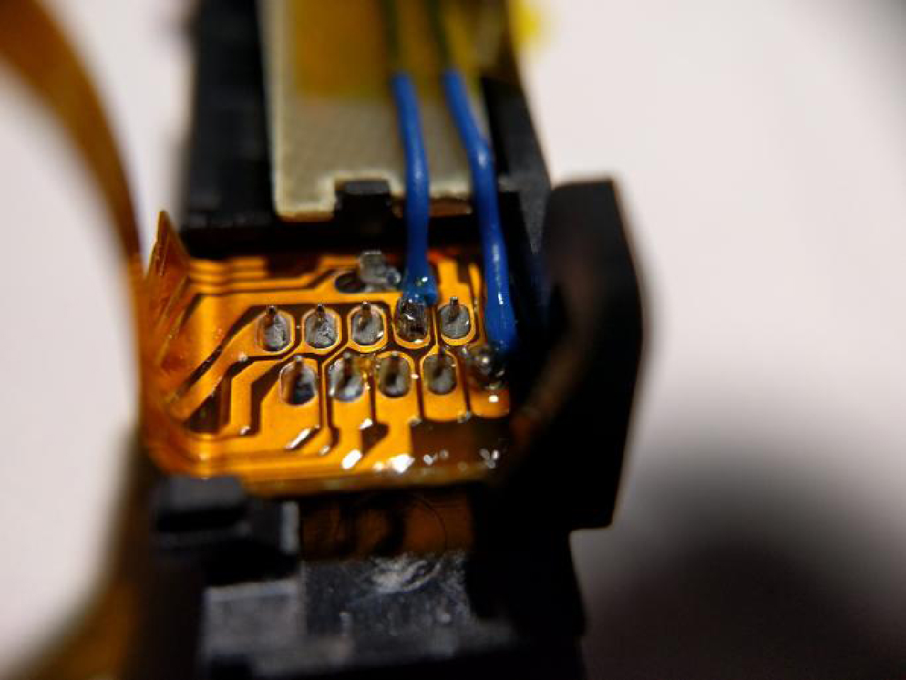

# Entrer en RCM

Comme la Switch utilise un processeur Tegra X1, elle possède un recovery mode qui est, dans la pluspart des cas, inutile pour l'utilisateur final. Heureusement, grâce à la faille fusée-gelée, ce mode spécial devient une porte d'entrée au CFW.

Il y a plusieures façons d'accéder au RCM (**R**e**C**overy **M**ode). La plus simple ne demande que des éléments que l'on peut facilement trouver chez sois, tandis que la plus viable (et efficace) est largement abordable (moins de 10€).

&nbsp;

!!! danger "Switch patchée"
    Notez que les consoles patchées **peuvent** entrer en RCM, mais il n'est pas possible d'envoyer un payload sur ces systèmes. Notez également que le RCM est un mode différent que celui qui peut être accédé en pressant les boutons Volume +, Volume - et Power.

!!! snippet "Note"
    Les méthodes présentées sur cette page sont rangées par ordre de difficulté : la méthode la plus rapide et simple est la première, et la plus difficile est la dernière.

&nbsp;

### Instructions

!!! tip ""
    1. Éteignez la Switch et utilisez une des méthodes listée ci-dessous pour créer un court-circuit entre les pins du rail du joycon de droite.
    2. Maintenez le bouton Volume + enfoncé et appuyez sur le bouton Power.

    Si votre Switch affiche le logo Nintendo et s'allume normalement, ou s'éteint immédiatement, alors vous n'avez pas réussi à entrer en RCM, il faut donc recommencer la manipulation. Sinon, si votre console ne s'allume pas et que l'écran reste noir, votre Switch est en RCM.

!!! tip ""
    ### RCM Jig (Le plus simple pour les débutants)
    

        
Cliquez pour afficher !

    !!! snippet "Note"
        Quelques jig ont le même design qu'un trombone, et héritent donc des risques encourus par la méthode du pont en métal/trombone. Si vous souhaitez un jig sécurisé, nous recommandons [switchjigs.com](https://switchjigs.com).

    Cette méthode est similaire au pont en métal/trombone, mais elle est beaucoup plus efficace et sûre. Les jigs contiennent un fil de fer qui permet de relier le pin numéro 10 à la terre.

    Les jigs que nous recommandons sont légèrement plus chers que ceux produits en masse, mais nous pouvons garantir leur qualité.

    !!! tip ""
        
		
	Dans le cas où vous souhaiteriez créer votre propre jig, cette image montre nes numéros des pins. Faites attention à ce que votre jig ne touche JAMAIS le pin 4, celui-ci envoie une tension de 5V pour alimenter le joycon. S'il est connecté à un autre pin, vous allez griller votre console.

	!!! tip ""
		

!!! tip ""
    ### Soudure des pads du Joy-Con - Bouton RCM physique. (Le plus sûr)
    

        
Cliquez pour afficher !

    !!! snippet "Note"
        Cette méthode vous demande d'ouvrir votre Joy-Con droit, mettant fin à sa garantie.

    Cette méthode vient de pbanj#9188 sur Discord. Toutes les images proviennent de lui, avec quelques suppléments apportés par by eip ∞#3283 sur Discord.
	
	Le but de cette méthode est d'ouvrir le Joy-Con droit afin d'accéder aux pads de contact facilement. Cela est similaire à la méthode précédente, mais vous allez souder un fil du pin 7 au pin 10 (voir ci dessous) et les relier au "bouton de détachement du Joy-Con" (petit bouton rond en haut derrière le Joy-Con).

	!!! tip ""
        

    Afin de débuter avec cette méthode, vous allez devoir vous munir de deux longeurs de fil et faire un petit cercle avec l'une des extrémité.

    !!! tip ""
        
		
	Vous allez ensuite prendre la partie circulaire de l'un de ces fils et ajouter un peu de soudure, en le gardant le plus plat possible (SEULEMENT SUR UN DES DEUX FILS). Vous allez ensuite collerce fil juste sous le "bouton de détachement du Joy-Con". Faites attention à ne pas recouvrir le haut du cable, cela agirait comme un isolant. De plus, faites en sorte de laisser assez d'espace pour que le bouton fonctionne correctement. Essayez de pousser le bouton de l'extérieur afin de déterminer où vous pouvez mettre de la colle.
	
	!!! tip ""
        
		
	!!! tip ""
        
		
	Le premier fil devrait être mis en place tel que le montre le cercle vert ci-dessosu. Le second fil n'a pas besoin de soudure, à la place vous allez utiliser une vis pour le maintenir, comme indiqué par le cercle rouge de l'image ci-dessous.

	!!! tip ""
        

	Lorsque vous appuyez sur le bouton, vous devriez remarquer que le point de soudure crée un contact avec la pièce en métal maintenue par la vis. Une fois ces éléments mis en place, connectez un cable au pad 7 et un autre au pad 10. Vous avez ainsi créé un bouton RCM ! Il vous suffit de le maintenir lorsque vous allez tenter de rentrer en RCM.

	!!! tip ""
        

!!! tip ""
    ### Soudure des pads du Joy-Con - 7 & 10
    

        
Cliquez pour afficher !

    !!! snippet "Note"
        Cette méthode vous demande d'ouvrir votre Joy-Con droit, mettant fin à sa garantie.

    Le but de cette méthode est d’ouvrir le Joy-Con droit  afin d'accéder aux pads de contact facilement. Ceci est similaire à la méthode précédente, mais l’objectif est de souder les broches 7 et 10 (montrées ci-dessous) avec une surface-mount 0805 résistance 10k. En plus d’utiliser un interrupteur physique/bouton, cette méthode est actuellement considéré comme la plus sûre qui implique la soudure pour les pads.

	!!! tip ""
        

    Voici un exemple de stuckpixel#3421 du serveur ReSwitched sur Discord.

    !!! tip ""
        

!!! tip ""
    ### Soudure des pads du Joy-Con - 9 & 10
    

        
Click to expand!

    !!! snippet "Note"
        Cette méthode se traduira par le Joy-Con droit étant détecté comme en mode sans fil lorsqu’il est attaché à la Switch. De plus, cette méthode peut entraîner le Joy-Con à être détecté en permanence comme étant une manette sans fil si vous mettez à jour le Joy-Con pendant que ce mod est installé. Si tel est le cas, pour résoudre ce problème, il faut ouvrir le Joy-Con et réinitialiser la batterie. Il est recommandé de souder les pads 7 et 10 avec une résistance à la place.

    !!! snippet "Note"
        Cette méthode vous demande d'ouvrir votre Joy-Con droit, mettant fin à sa garantie.

     Le but de cette méthode est d’ouvrir le Joy-Con droit  afin d'accéder aux pads de contact facilement. Ceci est similaire à la méthode précédente, mais l’objectif est de souder les broches 9 et 10 (montrées ci-dessous) ensemble. Cela peut être fait à l’aide d’un petit fil, ou directement en soudant les deux pads.

	!!! tip ""
        
	
    Voici un exemple de YyAoMmIi#3705 sur le serveur Discord.

    !!! tip ""
        

!!! tip ""
    ### Plier les pins (Non recommandé)
    

        
Click to expand!

    !!! snippet "Note"
        Cette méthode se traduira par le Joy-Con droit étant détecté comme en mode sans fil lorsqu’il est attaché à la Switch. De plus, cette méthode peut entraîner le Joy-Con à être détecté en permanence comme étant une manette sans fil si vous mettez à jour le Joy-Con pendant que ce mod est installé. Si tel est le cas, pour résoudre ce problème, il faut ouvrir le Joy-Con et réinitialiser la batterie.

    !!! snippet "Note"
        Cette méthode vous demande d'ouvrir votre Joy-Con droit, mettant fin à sa garantie.

    Le but de cette méthode est d’ouvrir le Joy-Con droit  afin d'accéder aux pads de contact facilement, et d'utiliser un objet fin, comme un couteau, pour délicatement relier les pins 9 et 10 (voir ci-dessous) pour qu'ils se touchent.

    !!! tip ""
        

    Voici un exemple de Sonlen#1414 sur le serveur Discord.

    !!! tip ""
        

&nbsp;

#### [Continuer sur l'envoi d'un payload <i class="fa fa-arrow-circle-right fa-lg"></i>](sending_payload_fr.md)
