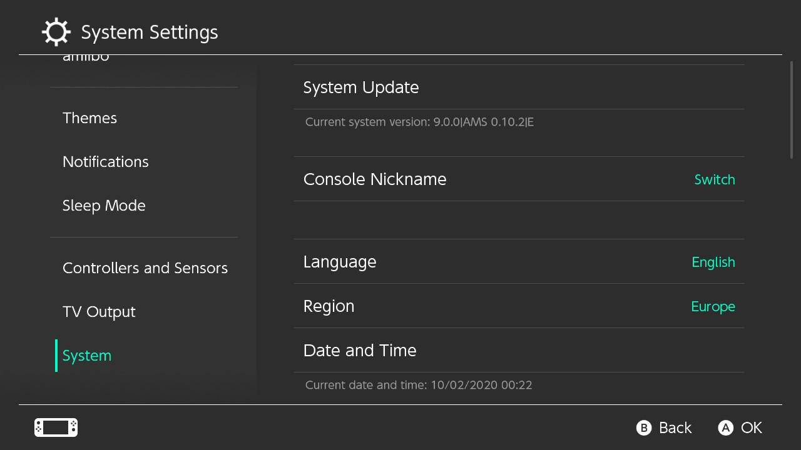

# Lancer un CFW

Maintenant que la préparation est terminée, nous sommes enfin prêts à lancer le custom firmware sur la Switch.

Contrairement à des systèmes tels que la DSi, la Wii, ou la 3DS, le CFW de la Switch est actuellement volatile. Il ne fonctionnera que tant que votre console est allumée. Dès que votre Switch s'éteint pour n'importe quelle raison (arrêt, plus de batterie, etc.), le CFW ne sera plus actif et vous devrez suivre ces instructions à nouveau.

&nbsp;

!!!danger "Gardez l'emuMMC hors ligne quoi qu'il arrives"
    Votre  emuMMC (emuNAND) ne doit jamais se connecter à Nintendo. Pour jouer en ligne, utiliser l'eShop ou toute autre activité en ligne proposée par Nintendo, utilisez votre sysNAND. Utiliser à la fois votre emuMMC et votre sysNAND en ligne entraînera probablement un banissement de la console.

### Instructions

!!! tip ""
    1. Lancez le RCM et injectez le payload Hekate
    2. Ouvrez le menu `Launch` avec l'écran tactile
    3. Lancez `Atmosphere FSS0 EmuMMC`

Votre Switch va maintenant démarer avec Atmosphère.

Pour vérifier qu'Atmosphère a été lancé correctement, ouvrez l’applet Paramètres puis Console. Vous devriez voir 'AMS' à côté du numéro de version, ainsi qu’un 'E' à la fin, indiquant que vous utilisez l'emuMMC.

&nbsp;

!!! tip ""
    

&nbsp;

### Lancer le menu homebrew

Vous pouvez désormais lancer le menu Homebrew en ouvrant l’album ou en maintenant le bouton R tout en lançant n’importe quel jeu (y compris les démos/cartouches) ou une application (par exemple Youtube/Hulu). Si R n’est pas tenu, le jeu ou l’application sera lancé comme d’habitude.
    
!!! warning "Note importante sur l'utilisation de l'album pour lancer le menu homebrew"
    - L’utilisation de l’album pour lancer le menu Homebrew au lieu d’un jeu ou d’une application a plusieurs limites, tel que : une plus petite quantité de mémoire disponible (RAM), ainsi que d’être incapable de lancer un navigateur Web complet. Il est fortement recommandé de lancer le menu homebrew à travers des applications ou des jeux à la place. Si vos jeux ne s’affichent pas comme « installés » sur votre Switch, copiez le contenu du dossier « Nintendo » de la racine de la carte SD dans le dossier `emummc/RAW1/Nintendo`
    
!!! tip "Ajouter de nouvelles applications"
    - Placez les applications homebrew (fichiers `.nro`) dans le dossier `switch` de votre carte SD.

&nbsp;

### Présentation des homebrews inclus

!!! tip ""
    - JKSV est un gestionnaire de fichiers de sauvegarde, il peut copier et restaurer les sauvegardes de votre système. Pour plus d’informations, voir [Gestion des sauvegardes](../../extras/save_management_fr.md).

    - FTPD est un outil ftp pour connecter sans fil la carte sd de votre Switch à votre PC. Des outils comme WinSCP peuvent se connecter à votre Switch sur `(ip de la Switch):5000`.

    - NX-Shell est un explorateur de fichiers pour la Switch. Vous pouvez déplacer des fichiers, écouter des fichiers mp3, voir des images, etc.

    - NXThemeInstaller est une application pour installer des thèmes. Voir la [section sur ce sujet de notre guide](../../extras/theming_fr.md) pour plus d’informations.

    - hbappstore est un eShop d’applications homebrew où une grande collection de homebrew pour la Switch est disponible.

&nbsp;

### Mettre à jour votre setup

!!! tip ""
    Quand une nouvelle mise à jour de la console est disponible, vous devrez certainement mettre à jour vos fichier pour le CFW. Pour ce faire, suivez les instrucrions de [cette page](../../extras/updating_fr.md).