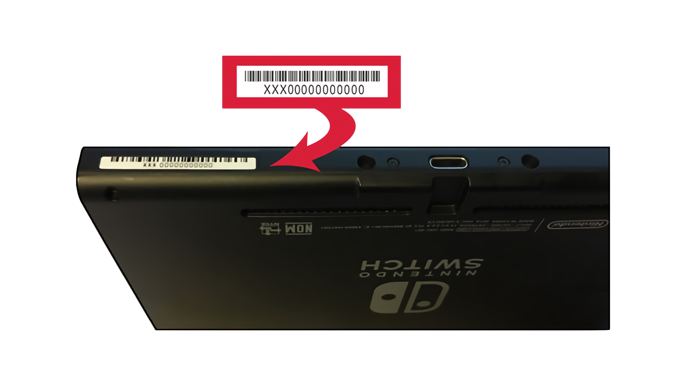

# Commencement

## Glossaire et FAQ

N'hésitez pas à jeter un œil au [glossaire](../extras/glossary_fr.md) afin de vous familiariser avec les termes techniques et à la FAQ avant de vous jeter tête baissée dans ce guide !

### Trouver votre numéro de série

La première chose à faire est de déterminer si votre Switch est vulnérable à fusée-gelée, la faille qui va être utilisée pour lancer le CFW.

Cette faille été découverte indépendamment par de nombreuses équipes de hack de la Switch, et de nombreux variants ont été publiés en avril 2018 après une période de divulgation de 90 jours terminée. Nintendo et NVIDIA ont été informés du problème avant la sortie publique, et les consoles qui n'étaient plus vulnérables à la faille ont commencé à apparaitre en juillet 2018. NVIDIA a [publiquement reconnu la faille](https://nvidia.custhelp.com/app/answers/detail/a_id/4660/~/security-notice%3A-nvidia-tegra-rcm-vulnerability) en avril. En juillet 2019, Nintendo annonce de nouveaux modèles, une version 100% portable de la Switch baptisée la Switch Lite (HDH-001), et une nouvelle version de la Switch originale (HAC-001-01) avec une meilleure autonomie de batterie. Chacune de ces deux nouvelles versions utilise un nouveau processeur nommé T210b01 (aussi connu sous le nom T214 et Mariko) avec une nouvelle bootROM et qui ne sont pas hackables aujourd'hui.

Les consoles patchées et les Mariko peuvent être identifiées par leur numéro de série. Ce numéro peut être trouvé sur le bas de votre Switch, à côté du port USB-C, ou dans les paramètres de la console **Console -> Numéros de série**.

&nbsp;

!!! tip ""
    

!!! tip ""
        

&nbsp;

### Déterminer si votre Switch est vulnérable.

La communauté homebrew a créé une liste des numéros de série qui sont vulnérables à fusée-gelée.

- Si votre numéro de série est dans la liste des "Potentiellement patché", continuez de suivre les instructions du guide pour déterminer si votre console est vulnérable.
- Si votre numéro de série est dans la liste des "Patché", il n'y a rien que vous puissiez faire à aujourd'hui.
- Si votre console est patchée, il est vivement recommandé de la conserver en 7.0.1 ou moins (si possible) car il y aura peut-être une faille exploitable pour ces versions dans un futur assez lointain. ** Ne mettez PAS À JOUR les consoles patchées au delà de 7.0.1 si vous voulez un jour avoir une chance de lancer des homebrews et/ou un CFW dessus.**

!!! tip "Notice"
    Si vous n'êtes pas sûr que votre console soit patchée, vous pouvez le tester vous-même en suivant [ces instructions](emummc/sending_payload_fr.md)

-----

&nbsp;

### Liste des numéros de série

L'information qui suit est basée sur cette [discussion de GBATemp](https://gbatemp.net/threads/switch-informations-by-serial-number-read-the-first-post-before-asking-questions.481215/).

|  Numéro de série  | Non patché | Potentiellement patché | Patché |
| :----|:---------------------------------|:---------------------------------|:----------------------|
| XAW1 | XAW10000000000 à XAW10074000000 | XAW10074000000 à XAW10120000000 | XAW10120000000 et plus |
| XAW4 | XAW40000000000 à XAW40011000000 | XAW40011000000 à XAW40012000000 | XAW40012000000 et plus |
| XAW7 | XAW70000000000 à XAW70017800000 | XAW70017800000 à XAW70030000000 | XAW70030000000 et plus |
| XAJ1 | XAJ10000000000 à XAJ10020000000 | XAJ10020000000 à XAJ10030000000 | XAJ10030000000 et plus |
| XAJ4 | XAJ40000000000 à XAJ40046000000 | XAJ40046000000 à XAJ40060000000 | XAJ40060000000 et plus |
| XAJ7 | XAJ70000000000 à XAJ70040000000 | XAJ70040000000 à XAJ70050000000 | XAJ70050000000 et plus |
| XKW1 | **N/A** | **N/A** | XKW10000000000 et plus |
| XKJ1 | **N/A** | **N/A** | XKJ10000000000 et plus |
| XJW1 | **N/A** | **N/A** | XJW01000000000 et plus |
| XWW1 | **N/A** | **N/A** | XWW01000000000 et plus |

&nbsp;

### Préparation de la console

!!! danger "Important"
    Avant de se lancer dans le hack de la console, il est important d'avoir au moins un jeu eShop (comme [Onigiri](https://www.nintendo.com/games/detail/onigiri-switch/)), une application (comme [YouTube](https://www.nintendo.com/games/detail/youtube-switch/ ou [Hulu](https://www.nintendo.com/games/detail/hulu-switch/)), ou une démo (comme [10 Second Run RETURNS](https://www.nintendo.com/games/detail/10-second-run-returns-switch)). Lancer le menu homebrew depuis une cartouche fonctionne également, mais celle-ci doit être insérée. Lancer le menu homebrew ne remplace pas de façon permanente le jeu ou l'application, et il ne devient pas non plus lié à ce jeu ou cette application. Une fois que vous avez au moins un jeu ou une application, vous êtes prêt à continuer.
&nbsp;

-----

### Table des versions

!!! note "Note"
    Les guides Nereba et Caffeine sont toujours en préparation (WIP) !

!!! note "Note"
    Bien que la "nouvelle" Switch (HAC-001-01) peut avoir un FW 7.0.1, elle **n'est pas** vulnérable à la faille *déjà vu*, faille utilisée par Nereba et Caffeine, à cause d'un changement matériel par rapport aux "anciennes" Switch (HAC-001).

&nbsp;

| Version du FW | Switch non patchée (HAC-001) | Switch patchée (HAC-001) | "Nouvelle" Switch (HAC-001-01)   | Switch Lite (HDH-001)  | 
|:---------------|:-----------------------------------|:---------------------------|:----------------------------|:-----------------------|
| 1.0.0          | Nereba ou [**RCM**](rcm_fr.md)     | **N/A**                    | **N/A**                     | **N/A**                |
| 2.0.0 - 3.0.2  | Caffeine ou [**RCM**](rcm_fr.md)   | **N/A**                    | **N/A**                     | **N/A**                |
| 4.0.0 - 4.1.0  | Caffeine ou [**RCM**](rcm_fr.md)   | Caffeine                   | **N/A**                     | **N/A**                |
| 5.0.0 - 7.0.0  | [**RCM**](rcm_fr.md)               | En attente de CFW          | **N/A**                     | **N/A**                |
| 7.0.1          | [**RCM**](rcm_fr.md)               | En attente de CFW          | Cart update to 8.0.1        | **N/A**                |
| 8.0.1          | [**RCM**](rcm_fr.md)               | En attente de homebrew     | En attente de homebrew      | En attente de homebrew |
| 8.1.0 - 13.0.0 | [**RCM**](rcm_fr.md)               | Non hackable (aujourd'hui) | Non hackable (aujourd'hui)  | Non hackable (aujourd'hui) |

&nbsp;

#### [Si votre Switch n'est pas patchée, continuer vers le RCM <i class="fa fa-arrow-circle-right fa-lg"></i>](rcm_fr.md)
