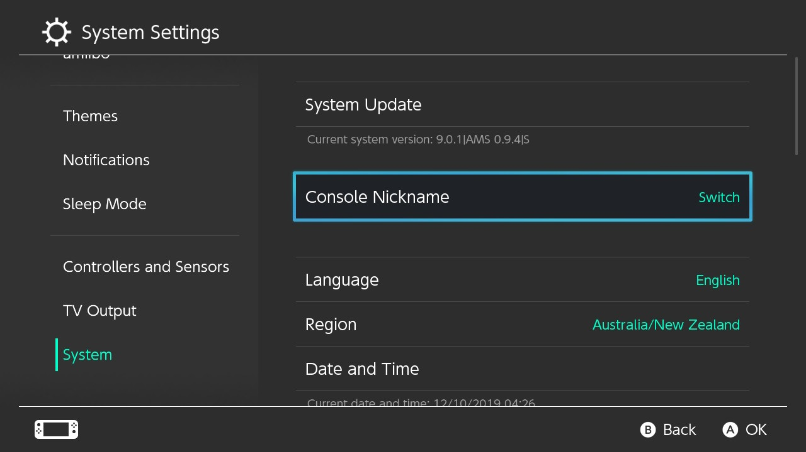

# Lancer un CFW

Maintenant que la préparation est terminée, nous sommes enfin prêts à lancer le custom firmware sur la Switch.

Contrairement à des systèmes tels que la DSi, la wii, ou la 3DS, le CFW de la Switch est actuellement volatile (il ne fonctionnera que tant que votre console est allumée. Dès que votre Switch s'éteint pour n'importe quelle raison (arrêt, plus de batterie, etc.), le CFW ne sera plus actif et vous devrez suivre ces instructions à nouveau.
&nbsp;

### Instructions

!!! tip ""
    1. Lancez la Switch en RCM et injectez le payload Hekate
    2. Allez dans le menu `Launch` en utilisant l'écran tactile
    3. Lancez `Atmosphere FSS0 SYS`

Votre Switch va maintenant démarrer sous Atmosphère.

Pour vérifier qu'Atmosphère a été lancé correctement, ouvrez l’applet Paramètres puis Console. Vous devriez voir 'AMS' à côté du numéro de version, ainsi qu’un 'S' à la fin, indiquant que vous utilisez la sysMMC.

&nbsp;

!!! tip ""
    

&nbsp;

### Présentation des homebrews inclus

Vous pouvez désormais lancer le menu Homebrew en ouvrant l’album ou en tenant le bouton R tout en lançant n’importe quel jeu (y compris les démos/cartouches) ou une application (par exemple Youtube/Hulu). Si R n’est pas tenu, le jeu ou l’application sera lancé comme d’habitude.
    
!!! warning "Note importante sur l'utilisation de l'album pour lancer le menu homebrew"
    - L’utilisation de l’album pour lancer le menu Homebrew au lieu d’un jeu ou d’une application a plusieurs limites, tel que : une plus petite quantité de mémoire disponible (RAM), ainsi que d’être incapable de lancer un navigateur Web complet. Il est fortement recommandé de lancer le menu homebrew à travers des applications ou des jeux à la place.
    
!!! tip "Ajouter de nouvelles applications"
    - Placez les applications homebrew (fichiers `.nro`) dans le dossier `switch` de votre carte SD.

&nbsp;

### Présentation des homebrews inclus

!!! tip ""
    - Checkpoint est un gestionnaire de fichiers de sauvegarde, il peut copier et restaurer les sauvegardes de votre système. Pour plus d’informations, voir [Gestion des sauvegardes](../../extras/save_management_fr.md).

    - FTPD est un outil ftp pour connecter sans fil la carte sd de votre Switch à votre PC. Des outils comme Filezilla peuvent se connecter à votre Switch sur `(ip de la Switch):5000`.

    - NX-Shell est un explorateur de fichiers pour la Switch. Vous pouvez déplacer des fichiers, écouter des fichiers mp3, voir des images, etc.

    - NXThemeInstaller est une application pour installer des thèmes. Voir la [section sur ce sujet de notre guide](../../extras/theming_fr.md) pour plus d’informations.

    - hbappstore est un eShop d’applications homebrew où une grande collection de homebrew pour la Switch est disponible.
